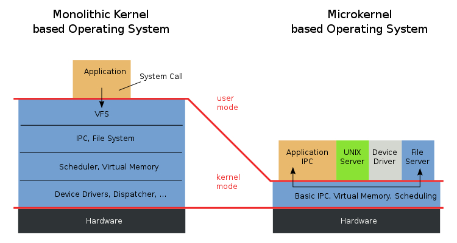
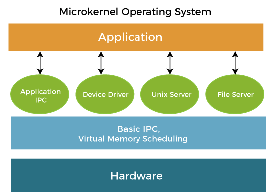
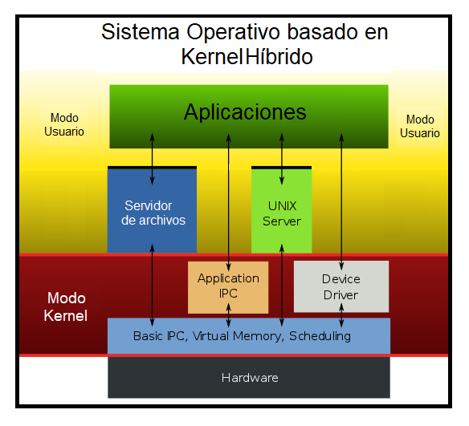
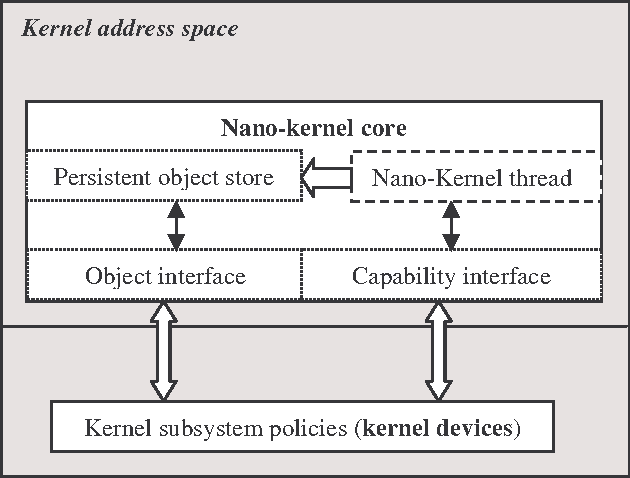
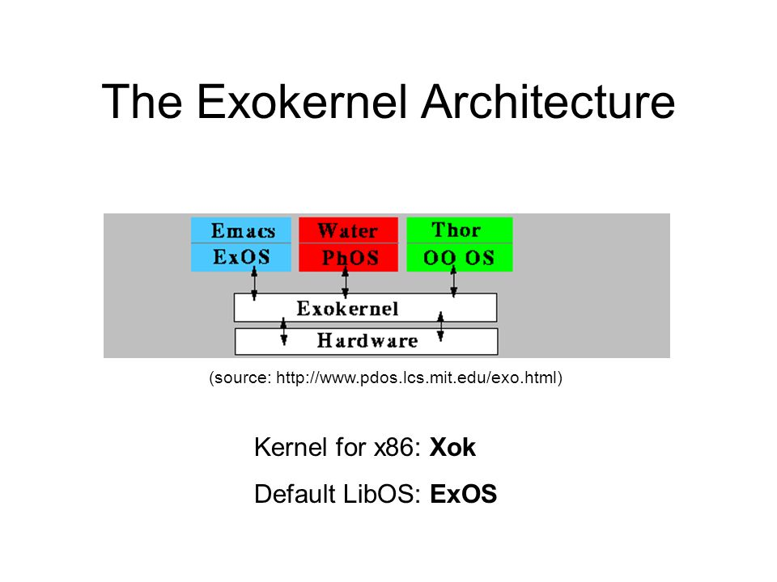
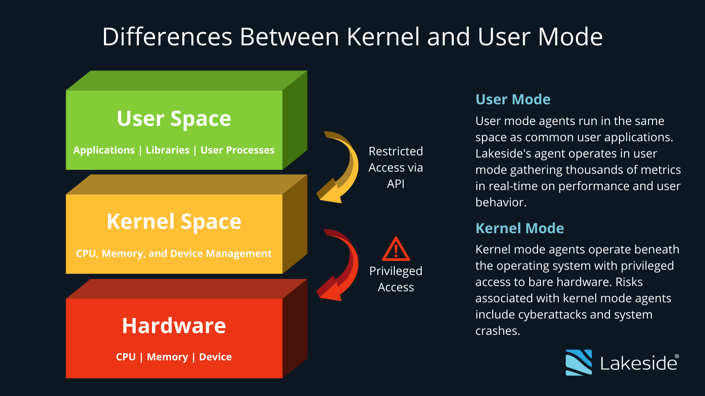

# Tipos de Kernel Y sus Diferencias

### hay cinco tipos principales de Kernel 

#

## 1. Kernel Monolitico 

### Un núcleo monolítico es un marco de software de sistema operativo que posee todos los privilegios para acceder a dispositivos de entrada / salida (E / S), memoria, interrupciones de hardware y la pila de CPU. Los núcleos monolíticos tienden a ser más grandes que otros núcleos porque tratan con muchos aspectos del procesamiento de la computadora en el nivel más bajo y, por lo tanto, tienen que incorporar código que interactúe con muchos dispositivos, E / S y canales de interrupción, y otros operadores de hardware.

### Esta forma de núcleo es la base para Linux, Unix, MS-DOS y Mac OS. Los sistemas operativos más nuevos generalmente usan un núcleo híbrido para permitir un mantenimiento más sencillo y mejoras en el sistema operativo.

#
## 2. MicroKernel 

### El estilo arquitectónico de Microkernel o también conocido como arquitectura de Plug-in, permite crear aplicaciones extensibles, mediante la cual es posible agregar nueva funcionalidad mediante la adición de pequeños plugins que extienden la funcionalidad inicial del sistema.

### En una arquitectura de Microkernel las aplicaciones se dividen en dos tipos de componentes, en sistema Core (o sistema central) y los plugins (o módulos), el sistema Core contiene los elementos mínimos para hacer que la aplicación funcione y cumpla el propósito para el cual fue diseñada, por otra parte, los módulos o plugins con componentes periféricos que se añaden o instalan al componente Core para extender su funcionalidad. En este sentido, solo puede haber un componente Core y muchos Plugins.
#

## 3. Kernel Hibrido

## Estos combinan monoliticos y microkernels. Incluyen mas servicios que microkernels pero menos que nucleos monoliticos. Esto permite tener beneficios de ambos tipos de kernels. La combinacion toma la velocidad de los monoliticos y modularidad de los microkernels.

#
## 4. Nano Kernel

## Tipo mas pequeño de kernel. Consta soamente de miles de lineas de codigo (pequeña para ser de este campo). Esto implica que el codigo ejecutado en el hardware se ejecuta con el minimo. Se utilizan recursos limitados.

#

## 5. Exo Kernel 

## Tiene proteccion y gestion de recursos por separado. Es adecuado para cuando se hace un personalizacion en una aplicacion. Se usan mas en ambitos como dispositivos moviles. Es como un microkernel pero con caracteristicas especificamente para dispositivos moviles.

# User Vs Kernel Mode 

## Modo Usuario

### Es cuando un progrma se inicia en un sistema operativo, por ejemplo cuando Windows se encarga de crear un espacion de direcciones virtuales para un proceso en especifico.En este modo los programas son menos prvilegiados y no se les permite acceder directamente a recursos del sistema, primero pasa por el sistema operativo mediante syscalls.

#
## Modo Nucleo o Kernel 

### El kernel es el progrmaa central en el que se basan todos los demas componentes del sistema operativo. Se usa para acceder a componentes de hardware y programar procesos que deben ejecutardse en el sistema. Gestiona la interaccion del software y hardware de la aplicacion. Por lo tanto es el programa mas privilegiado a diferencia de otros. Cuando un programa que se ejecuta en modo usuario necesita acceso de hardware por ejemplo camara web, primero pasa por el kernel usando una pantalla del sistema.

#

